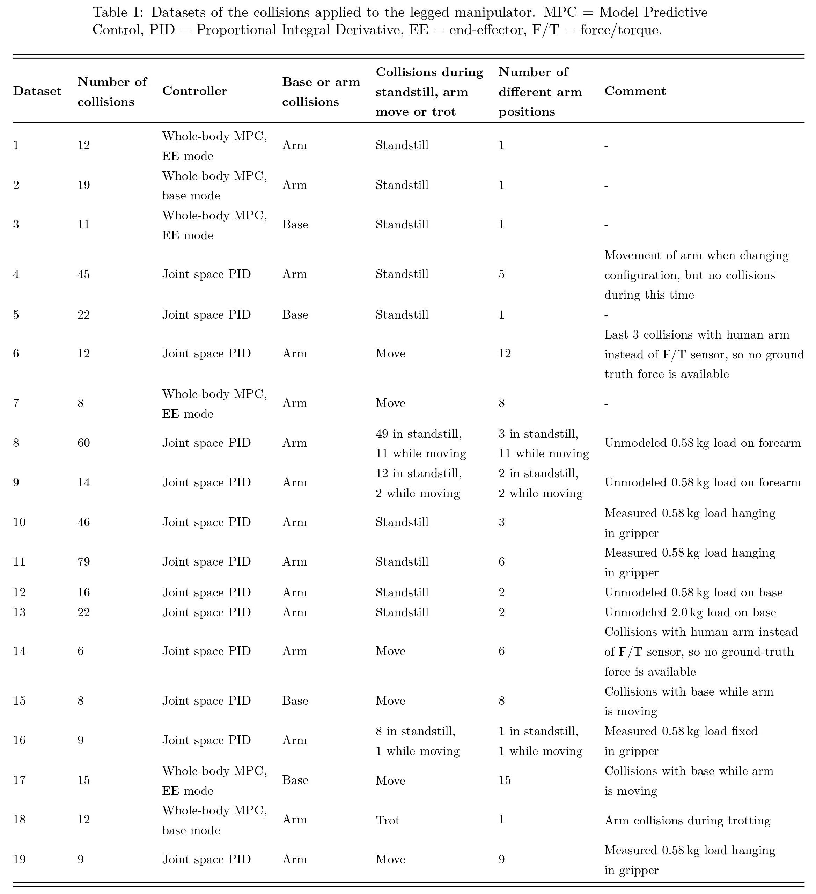

## Datasets description
The table containing the information and numbering of the rosbags, is found below. All datasets are found in the folder `/datasets` and the numbering is equal to the numbering in the table. For each dataset, there is one .mat file and one .txt file. The .txt file contains a description of the contact location and direction of the applied collisions. The .mat file contains the following terms, required as an input for the steps of the collision event pipeline (note that the size is the size of the vector/matrix/double at one time instant):

| **Parameter**          	| **Description**                                                                                                          	| **Unit** 	| **Size** 	| **Matlab name**          	|
|------------------------	|--------------------------------------------------------------------------------------------------------------------------	|----------	|----------	|--------------------------	|
| $q$                    	| Generalized coordinates                                                                                                  	| rad      	| 24x1     	| `q`                      	|
| $\dot{q}$              	| Generalized velocities                                                                                                   	| rad/s    	| 24x1     	| `qd`                     	|
| $\dot{q}_{\text{des}}$ 	| Desired joint velocities                                                                                                 	| rad/s    	| 18x1     	| `qd_des`                 	|
| $\tau_{\text{m}}$      	| Measured motor torques                                                                                                   	| Nm       	| 18x1     	| `taum`                   	|
| $M$                    	| Inertia matrix                                                                                                           	| kg m^2   	| 24x24    	| `massMatrix`             	|
| $n$                    	| Nonlinear terms                                                                                                          	| Nm       	| 24x1     	| `nonlinearTerms`         	|
| $\|F\|$                	| Magnitude ground truth collision force                                                                                   	| N        	| 1x1      	| `magFTforce`             	|
| $J_{\text{f}}$         	| Stacked translational feet Jacobians                                                                                     	| -        	| 12x24    	| `jacobiansFeet`          	|
| $J_{i}$                	| Spatial colliding link Jacobians (order of Jacobians in cell: upperarm,  forearm, wrist 1, wrist 2, gripper, base) 	| -        	| 6x24     	| `jacobiansCollidingLink` 	|
| $t$                    	| Time                                                                                                  	| sec      	| 1x1     	| `time`                      	|

A few additional notes on the datasets:
- The calibrated measurements for the force/torque (F/T) sensor at the end-effector are only available in rosbags 5, 8, 10, 11, 12, 13, 14 and 19.
- The number of collisions in the table sum up to 425, while in the paper we refer to 416 experiments. Dataset 14, containing 9 collisions with the human arm, and dataset 6, where the last 3 collisions are also with a human arm, are not considered in the paper. No ground truth F/T sensor collision force is availble for these datasets, but the data can be used to test collision detection methods.   

## Code description
The parameters used in the code are the following (note that the size is the size of the vector/matrix/double at one time instant):
| **Parameter**              	| **Description**                                                                                                                                                   	| **Unit** 	| **Size** 	| **Matlab name**        	|
|----------------------------	|-------------------------------------------------------------------------------------------------------------------------------------------------------------------	|----------	|----------	|------------------------	|
| $N$                        	| End index of time vector                                                                                                                                          	| -        	| 1x1      	| `endInd`               	|
| $T_{\text{s}}$             	| Sampling time                                                                                                                                                     	| sec      	| 1x1      	| `Ts`                   	|
| $t$                        	| Linearly spaced time vector                                                                                                                                       	| sec      	| 1x1      	| `timeVec`              	|
| $\hat{\tau}_{\text{ext}}$  	| Estimated external torques                                                                                                                                        	| Nm       	| 24x1     	| `torques`              	|
| $\hat{F}_{\text{ext}}$     	| Estimated external force                                                                                                                                          	| N        	| 3x1      	| `force`                	|
| $\hat{F}_{\text{ext,lpf}}$ 	| Estimated external force with added  low-pass filter (LPF)                                                                                                      	| N        	| 3x1      	| `forceLPF`             	|
| f_{\T{c}}                  	| Cut-off frequency LPF                                                                                                                                             	| Hz       	| 1x1      	| `fc`                   	|
| $T_\text{2peaks}$          	| If the second peak doesn't appear after  $T_\text{2peaks}$ sec, the ending of the collision  is detected                                                    	| sec      	| 1x1      	| `T_twopeaks`           	|
| $T_{\text{rippling}}$      	| If all force components are below the  threshold for $T_{\text{rippling}}$ sec after the   collision has ended, the collision has  officially disappeared 	| sec      	| 1x1      	| `T_rippling`           	|
| $\omega_{\text{min}}$      	| Minimum cut-off frequency band-pass filter (BPF)                                                                                                               	| Hz       	| 1x1      	| `cutOffFreqMin`        	|
| $\omega_{\text{max}}$      	| Maximum cut-off frequency BPF                                                                                                                                     	| Hz       	| 1x1      	| `cutOffFreqMax`        	|
| $b$                        	| Constant threshold for $x, y$ and $z$ components of filtered force                                                                                             	| N        	| 3x1      	| `constThresh`          	|
| $\epsilon$                 	| Collision bool                                                                                                                                                    	| -        	| 1x1      	| `collision`            	|
| $\hat{F}_{\text{ext}}$     	| Estimated collision force including  disturbances                                                                                                              	| N        	| 3x1      	| `forceEstimated`       	|
| $\hat{F}_{\text{c}}$       	| Estimated collision force excluding disturbances                                                                                                               	| N        	| 3x1      	| `forceCollision`       	|
| $\|\hat{F}_{\text{c}}\|$   	| Magnitude estimated collision force excluding disturbances                                                                                                     	| N        	| 3x1      	| `magEstForceCollision` 	|
| $\hat{F}_{\text{dis}}$     	| Estimated disturbance force                                                                                                                                       	| N        	| 3x1      	| `disturbance`          	|

The steps of the collision pipeline, followed in the sample code found in `main.m` are the following:
1. **External torque estimation.** In the file `momentum_observer.m`, the continuous-time momentum-based observer for floating-base robots is implemented, resulting in the estimated torques.
2. **External force estimation.** In the file `estimate_force_base_arm.m`, the stacked force vector containing the linear forces at the four feet of the legged manipulator, and the force on the colliding body part, are computed. The output is `force` (or `forceLPF` for estimation during trotting), which is a 2x1 cell containing the estimated force on the arm and base. 
3. **Collision detection.** In `collision_detection.m`, a BPF is applied to the estimated forces and with a constant threshold and the two-peaks phenomenon (described in the paper "Collision detection, isolation and identification for a legged manipulator"), a collision is detected. The bool `collision` indicates if a collision occurs for each time instant, with either a 0 or a 1. 
4. **Collision identification.** In `collision_identification.m` the disturbance forces are computed and subtracted from the estimated forces, resulting in the final estimated collision force. The magnitude of this final collision force is calculated such that it can be plotted against the ground truth F/T collision force. 

To extract and plot the collision data for a specific dataset, one needs to run the script `main.m`. The corresponding dataset can be selected with a call to the `load` function during the initialization of the same script (f.e. `load(dataset9);`).